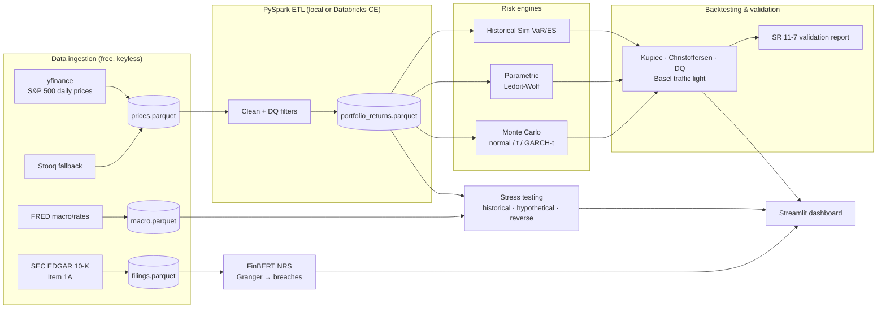

# RiskSense


A market risk engine for an S&P 500 equity portfolio that estimates **Value-at-Risk and Expected Shortfall the way regulators expect it done**: ES at 97.5% per **FRTB** (BCBS 2019), 99% one-day VaR backtested under the **Basel III** traffic-light framework, stress testing in the spirit of **CCAR**, and model validation structured after the Federal Reserve's **SR 11-7** guidance. Twenty years of daily prices for 503 S&P 500 constituents (2.4M rows) flow through a PySpark ETL into six VaR/ES engines, a four-test statistical backtesting suite, a stress-testing module, and a Streamlit risk dashboard — all running end-to-end on free infrastructure.

> Personal learning project by a Master's student, not production software. The limitations section at the bottom is honest on purpose.

## Architecture



## Methodologies

| Module | Method | Reference | Regulatory tag |
|---|---|---|---|
| `var/historical.py` | Rolling 250d historical simulation, VaR 99% + ES 97.5% | Jorion (2007); Acerbi & Tasche (2002) | FRTB MAR33, Basel III |
| `var/parametric.py` | Variance-covariance, normal & Student-t, Ledoit-Wolf shrinkage | Ledoit & Wolf (2004); McNeil-Frey-Embrechts (2015) | FRTB, SR 11-7 benchmarking |
| `var/monte_carlo.py` | 10k+ paths: MV-normal, MV-t, GARCH(1,1)-t | Bollerslev (1986) | FRTB, SR 11-7 |
| `backtesting/kupiec.py` | Proportion-of-failures LR test | Kupiec (1995) | Basel III outcomes analysis |
| `backtesting/christoffersen.py` | Independence + conditional coverage | Christoffersen (1998) | Basel III / SR 11-7 |
| `backtesting/dq_test.py` | Dynamic Quantile regression test | Engle & Manganelli (2004) | SR 11-7 |
| `backtesting/basel_traffic_light.py` | Green/Yellow/Red zones, capital multiplier add-ons | BCBS (1996) | Basel III |
| `stress/` | 2008/COVID/SVB replay, 8 hypothetical scenarios, reverse stress | BCBS stress testing principles (2018) | CCAR-style |
| `narrative/` | FinBERT on 10-K Item 1A → Narrative Risk Score; Granger vs breaches | Granger (1969) | SR 11-7 ongoing monitoring |
| `validation/` | Eight-section model validation report | Fed SR 11-7 / OCC 2011-12 | SR 11-7 |

## Live demo

**[View the dashboard →](https://YOUR_APP.streamlit.app)** *(Streamlit Community Cloud, free tier)*

The four artifacts the dashboard reads (~1 MB of parquet and JSON) are committed, so the deployed app renders from a clean clone without needing Spark or a data pull. The raw price history (28 MB) and per-ticker return matrix (35 MB) stay out of git — regenerate them locally with `setup.sh`.

## Quickstart

```bash
git clone https://github.com/Mohammed-Saif-07/risksense && cd risksense
./setup.sh                      # venv + deps + real data + full pipeline (~20 min)
source .venv/bin/activate
streamlit run dashboards/streamlit_app.py
```

Requirements: Python 3.10+, Java 11+ (local PySpark), internet for the initial data pull. **No cloud accounts, no API keys, no paid anything.** The same PySpark code runs unmodified on Databricks Community Edition if you want cluster experience.

Dependencies are split so the hosted dashboard builds fast: `requirements.txt` covers the engines, ingestion and dashboard; `requirements-spark.txt` adds PySpark (a ~320 MB wheel needing a JVM) for the ETL only. `setup.sh` and CI install both.

## Dashboard

Five pages, one visual system. The categorical palette is assigned in fixed order and **validated as a set** — lightness band, chroma floor, colour-vision-deficiency separation (worst adjacent ΔE 8.4), normal-vision separation (ΔE 19.3) and ≥3:1 contrast all pass against the dashboard surface — so an engine keeps its colour no matter how many are on screen, and status colours (Basel zones, test verdicts) are a reserved set never reused for a data series, always paired with a text label.

| Page | What it shows |
|---|---|
| Portfolio Overview | Headline VaR/ES, Basel zone, cumulative P&L over 5,198 trading days |
| VaR & Backtesting | Per-engine forecast vs realised P&L, exception markers, all four statistical tests, Basel traffic light |
| Engine Comparison | Six engines head-to-head — exception ranking, VaR paths, full scoreboard table |
| Stress Testing | 2008/COVID/SVB replay, eight hypothetical scenarios with attribution waterfalls, reverse stress search |
| Narrative Risk | Week 4 — FinBERT overlay (in progress) |

## What this demonstrates

Mapped to what a quantitative market risk seat actually involves:

- **VaR / ES modeling** — six engines on a uniform output schema so they are directly comparable: historical simulation, parametric normal and Student-t on a Ledoit-Wolf shrunk 500-asset covariance, and Monte Carlo under multivariate normal, multivariate t, and GARCH(1,1)-t.
- **Statistical validation** — Kupiec, Christoffersen, Engle-Manganelli and Acerbi-Székely with proper LR/Wald statistics, not exception counting.
- **Regulatory awareness** — Basel traffic-light zones with the actual BCBS capital multiplier add-ons; explicit framework tags on every module.
- **Stress testing** — crisis replay, eight hypothetical curve/equity/credit scenarios with attribution waterfalls, and a gradient-based reverse stress search.
- **Big-data engineering** — PySpark ETL over 2.4M price rows with documented data-quality filters.
- **Software craft** — type hints throughout, 100 tests at 89% coverage, CI on every push, every parameter in YAML.
- **Honest modelling** — the benchmarking result below is a *negative* result reported in full, and the double-count bug found in stress testing is documented rather than quietly fixed.

## A result worth reading

Backtested over 2006-2026 against ~49.5 expected exceptions at 99% VaR:

| Engine | Exceptions | ES Z₂ |
|---|---|---|
| Monte Carlo Normal | 157 | 1.506 |
| Parametric Normal | 156 | 1.497 |
| Monte Carlo Student-t | 130 | 1.206 |
| Parametric Student-t | 129 | 1.209 |
| Historical Simulation | 77 | 0.478 |
| Monte Carlo GARCH(1,1)-t | 66 | 0.465 |

The ordering is the textbook one and two independent test families agree on it: constant-volatility normal models understate tail risk worst, fat tails help, and conditional volatility helps most. Every engine still fails the Dynamic Quantile test over the full sample — no single-regime model kept exceptions unpredictable across both 2008 and 2020. That is reported, not tuned away.

## Roadmap (shipping weekly)

- [x] **Week 1** — ingestion (S&P 500 + FRED), PySpark ETL, Historical VaR/ES, Kupiec + Basel traffic light, dashboard v0, CI
- [x] **Week 2** — parametric (Ledoit-Wolf) + Monte Carlo (normal/t/GARCH-t) engines, Christoffersen + DQ + Acerbi-Székely tests, engine comparison page
- [x] **Week 3** — stress testing (historical replay, 8 hypothetical scenarios, reverse stress), factor attribution waterfalls, stress dashboard page
- [ ] **Week 4** — FinBERT narrative overlay, SR 11-7 validation report, polish

## Limitations (read this)

- **Equity-only, long-only, linear portfolio.** No options, no bonds, no FX — so no greeks-based revaluation; stress scenarios map macro shocks through estimated betas, not full repricing.
- **Historical simulation assumes the recent past spans the future.** A 250-day window missed February 2020 by construction; that's visible in the backtest and discussed in the validation report rather than hidden.
- **Correlations break in crises.** Ledoit-Wolf shrinkage conditions the covariance matrix; it does not fix non-stationary dependence. Tail dependence is only partially captured by Student-t copula-like MC.
- **Survivorship bias.** The universe is *today's* S&P 500 constituents; firms that failed or were delisted are underrepresented, which flatters historical risk estimates.
- **Free data caveats.** Yahoo adjusted closes can be restated; Stooq fallback rows are split- but not dividend-adjusted (tagged in the data for the DQ report).
- **One-day horizon only.** No sqrt-of-time scaling to 10-day VaR precisely because it understates fat-tailed risk.
- **Stress betas come from a calm three-year window.** FRED's ICE BofA credit-spread series are license-capped to ~3 trailing years, so the factor regression spans 2023-2026 (R² ≈ 0.23) — a period containing no equity crisis, which is exactly when the betas would matter most.
- **Marginal betas cannot be stacked.** A scenario that names an equity shock has its macro legs suppressed, so those scenarios are effectively equity-only. The alternative double-counts: pricing "equity −35% + IG +300bp" without the guard produced a nonsensical 98% loss.
- **NRS is correlational.** Granger causality is predictive precedence, not economic causation.

See [docs/limitations.md](docs/limitations.md) for all 22 documented limitations.

## License

MIT
