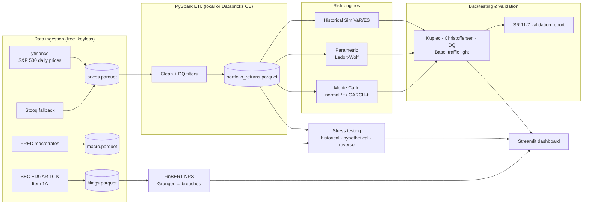

# RiskSense


A market risk engine for an S&P 500 equity portfolio that estimates **Value-at-Risk and Expected Shortfall the way regulators expect it done**: ES at 97.5% per **FRTB** (BCBS 2019), 99% one-day VaR backtested under the **Basel III** traffic-light framework, stress testing in the spirit of **CCAR**, and a model validation report structured after the Federal Reserve's **SR 11-7** guidance. Five-plus years of daily prices for ~500 S&P 500 constituents flow through a PySpark ETL into four independent VaR engines, a statistical backtesting suite (Kupiec, Christoffersen, Dynamic Quantile), and a Streamlit risk dashboard — all running end-to-end on free infrastructure.

> Personal learning project by a Master's student, not production software. The limitations section at the bottom is honest on purpose.

## Architecture



<!-- TODO(week 3): replace with animated dashboard GIF -->


## Methodologies

| Module | Method | Reference | Regulatory tag |
|---|---|---|---|
| `var/historical.py` | Rolling 250d historical simulation, VaR 99% + ES 97.5% | Jorion (2007); Acerbi & Tasche (2002) | FRTB MAR33, Basel III |
| `var/parametric.py` | Variance-covariance, normal & Student-t, Ledoit-Wolf shrinkage | Ledoit & Wolf (2004); McNeil-Frey-Embrechts (2015) | FRTB, SR 11-7 benchmarking |
| `var/monte_carlo.py` | 10k+ paths: MV-normal, MV-t, GARCH(1,1)-t | Bollerslev (1986) | FRTB, SR 11-7 |
| `backtesting/kupiec.py` | Proportion-of-failures LR test | Kupiec (1995) | Basel III outcomes analysis |
| `backtesting/christoffersen.py` | Independence + conditional coverage | Christoffersen (1998) | Basel III / SR 11-7 |
| `backtesting/dq_test.py` | Dynamic Quantile regression test | Engle & Manganelli (2004) | SR 11-7 |
| `backtesting/basel_traffic_light.py` | Green/Yellow/Red zones, capital multiplier add-ons | BCBS (1996) | Basel III |
| `stress/` | 2008/COVID/SVB replay, 8 hypothetical scenarios, reverse stress | BCBS stress testing principles (2018) | CCAR-style |
| `narrative/` | FinBERT on 10-K Item 1A → Narrative Risk Score; Granger vs breaches | Granger (1969) | SR 11-7 ongoing monitoring |
| `validation/` | Eight-section model validation report | Fed SR 11-7 / OCC 2011-12 | SR 11-7 |

## Quickstart

```bash
git clone https://github.com/YOUR_USERNAME/risksense && cd risksense
./setup.sh                      # venv + deps + real data + full pipeline (~15 min)
source .venv/bin/activate
streamlit run dashboards/streamlit_app.py
```

Requirements: Python 3.10+, Java 11+ (local PySpark), internet for the initial data pull. **No cloud accounts, no API keys, no paid anything.** The same PySpark code runs unmodified on Databricks Community Edition if you want cluster experience.

## What this demonstrates

Mapped to what a quantitative market risk seat actually involves:

- **VaR / ES modeling** — four independent engines with a uniform output schema, ES at the FRTB 97.5% level, fat-tail handling via Student-t and GARCH.
- **Statistical validation** — Kupiec, Christoffersen and Engle-Manganelli tests with proper LR/Wald statistics, not just exception counting.
- **Regulatory awareness** — Basel traffic-light zones with the actual BCBS capital multiplier add-ons; SR 11-7 structured validation report; explicit framework tags on every module.
- **Stress testing** — historical replay, hypothetical curve/equity/credit scenarios, reverse stress search.
- **Big-data engineering** — PySpark ETL over ~2.5M price rows, parquet + DuckDB warehouse.
- **ML for risk** — FinBERT narrative scoring with statistical (Granger) validation instead of vibes.
- **Software craft** — typed, tested (>70% coverage), CI on every push, zero magic numbers.

## Roadmap (shipping weekly)

- [x] **Week 1** — ingestion (S&P 500 + FRED), PySpark ETL, Historical VaR/ES, Kupiec + Basel traffic light, dashboard v0, CI
- [ ] **Week 2** — parametric + Monte Carlo engines, Christoffersen + DQ tests, engine comparison page
- [ ] **Week 3** — stress testing module, full dashboard
- [ ] **Week 4** — FinBERT narrative overlay, SR 11-7 validation report, polish

## Limitations (read this)

- **Equity-only, long-only, linear portfolio.** No options, no bonds, no FX — so no greeks-based revaluation; stress scenarios map macro shocks through estimated betas, not full repricing.
- **Historical simulation assumes the recent past spans the future.** A 250-day window missed February 2020 by construction; that's visible in the backtest and discussed in the validation report rather than hidden.
- **Correlations break in crises.** Ledoit-Wolf shrinkage conditions the covariance matrix; it does not fix non-stationary dependence. Tail dependence is only partially captured by Student-t copula-like MC.
- **Survivorship bias.** The universe is *today's* S&P 500 constituents; firms that failed or were delisted are underrepresented, which flatters historical risk estimates.
- **Free data caveats.** Yahoo adjusted closes can be restated; Stooq fallback rows are split- but not dividend-adjusted (tagged in the data for the DQ report).
- **One-day horizon only.** No sqrt-of-time scaling to 10-day VaR precisely because it understates fat-tailed risk.
- **NRS is correlational.** Granger causality is predictive precedence, not economic causation.

See [docs/limitations.md](docs/limitations.md) for the full discussion.

## License

MIT
